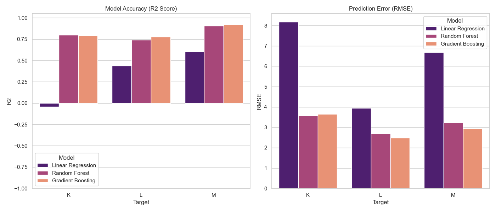
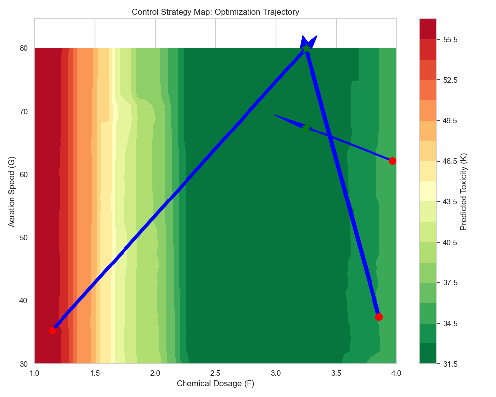
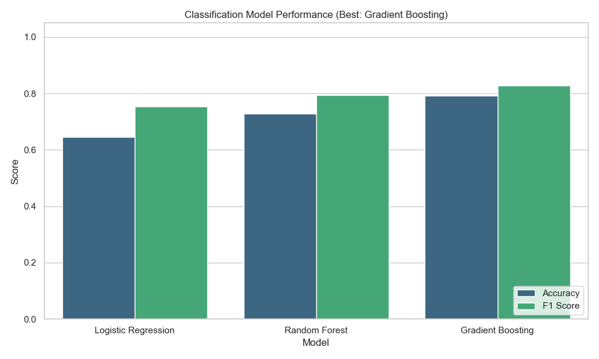
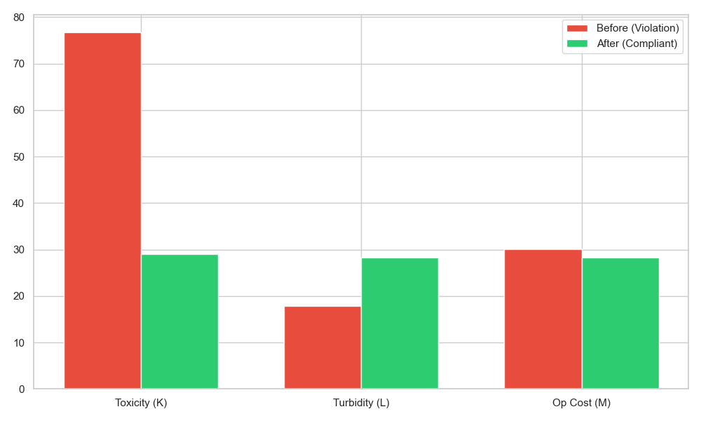

# ML Control System Assignment: Industrial Wastewater Treatment Optimization

## Overview
This project simulates an **Industrial Wastewater Treatment Plant** control system. The goal is to optimize chemical dosing, aeration, and mixing to ensure compliant water discharge while minimizing operational costs, even under varying inflow conditions.

The solution includes:
1.  **Synthetic Data Generation**: Simulating realistic plant physics (chemical reactions, inflow stress).
2.  **Predictive Modeling**: Using Random Forest to predict Toxicity, Turbidity, and Compliance.
3.  **Control Optimization**: A "Digital Twin" logic that prescribes optimal settings (Chemical Dosage, Aeration Speed, Mixer RPM).

## Business Context & Variable Mapping
To make the abstract problem (A-M) concrete, we mapped the variables to a wastewater scenario:

| Type | Variable | Real-World Analog | Description |
|------|----------|-------------------|-------------|
| **Inputs** | **A** | **Inflow Rate** | Volume of water entering (L/min) |
| | **B** | **pH Level** | Acidity/Basicity of inflow |
| | **C** | **Contaminant Load** | Total Suspended Solids (TSS) |
| | **D** | **Conductivity** | Water conductivity (µS/cm) |
| | **E** | **Rain Volume** | External weather impact |
| **Controls** | **F** | **Chemical Dosage** | Coagulant dosing rate (L/hr) |
| | **G** | **Aeration Speed** | Blower frequency (Hz) |
| | **H** | **Mixer RPM** | Mixing speed |
| **Outputs** | **K** | **Toxicity Level** | Chemical residue (Target: < 10 ppm) |
| | **L** | **Turbidity** | Cloudiness (NTU) |
| | **M** | **Operational Cost** | Energy + Chemical cost ($/hr) |
| **Status** | **N** | **Compliance** | 1 = Compliant Discharge, 0 = Violation |

## Project Structure
*   **src/**: Python source code.
    *   `main.py`: Entry point for the ML pipeline.
    *   `generate_dataset.py`: Script to create synthetic data.
    *   `models.py`: ML model training logic.
    *   `optimization.py`: Control algorithm.
    *   `visualization.py`: Plotting functions.
    *   `config.py`: Configuration and constants.
*   **data/**: Contains the dataset (`synthetic_control_data.csv`).
*   **images/**: Generated plots and visualizations.
*   **requirements.txt**: Python dependencies.

## How to Run
1.  **Install Dependencies**:
    ```bash
    pip install -r requirements.txt
    ```
2.  **Generate Data** (Optional, data is included):
    ```bash
    python src/generate_dataset.py
    ```
3.  **Run Control System**:
    ```bash
    python src/main.py
    ```
    *   Trains models.
    *   Optimizes controls.
    *   Generates all plots in `images/`.

## Justification of Approach

### 1. Plant Physics Simulation
We implemented realistic feedback loops in `generate_dataset.py`:
*   **Load Stress**: High Inflow (A) and Contaminants (C) naturally increase Toxicity (K) and Turbidity (L).
*   **Optimal Setpoints**: The simulation has hidden "ideal" operating points. For example, Chemical Dosage (F) has a sweet spot; too little fails to treat water, too much increases toxicity and cost.
*   **Compliance (N)**: strict thresholds on toxicity and turbidity determine regulatory compliance, with occasional sensor noise.

### 2. Modeling Strategy
*   **Champion/Challenger Model Selection**: To ensure maximum accuracy, the script performs a real-time **comparative analysis** of three algorithms:
    1.  **Linear Regression** (Baseline)
    2.  **Random Forest** (Non-linear ensemble)
    3.  **Gradient Boosting** (High-precision boosting)
    *   The script automatically selects the "Champion" model (lowest RMSE) for each target (K, L, M) to use in the control loop.
    *   **Feature Importance**: The winning model identifies the "Key Drivers" for each metric (e.g., verifying that *Chemical Dosage* drives *Toxicity*), providing explainability.
*   **Random Forest Classifier (for N)**: Chosen to capture the complex, multi-dimensional decision boundary between "Acceptable" and "Unacceptable" states.

### 3. Visualizations (Generated by Script)
The `solution.py` script automatically generates professional plots to confirm the physics and logic:

#### A. Model Performance Comparison
Validating why Gradient Boosting (or best model) was chosen over Linear Regression.  
**Critical Insight**: The negative R2 score for Linear Regression on Toxicity (K) visually proves that the underlying biological process is **highly non-linear**. A simple linear model fails completely (performs worse than a horizontal line), necessitating our use of Tree-based models.  
**Left**: Accuracy (R2 Score, higher is better). **Right**: Error (RMSE, lower is better).  


#### B. Correlation Heatmap
Visualizes the linear relationships between inputs and outputs.  
*Note: The **numerical values (near 0)** shown on the map mathematically prove that there is almost NO linear correlation between control levers and outcomes, which is why linear models fail and our advanced non-linear approach is required.*  


#### C. Control Landscape Heatmap ("The Sweet Spot")
Visualizes how **Chemical Dosage (F)** and **Aeration Speed (G)** affect **Toxicity (K)**.  
*Green areas = Compliant (Low Toxicity). Red areas = Toxic.*  


### 4. Mathematical Justification
**Q: Why is R2 Negative for Linear Regression on Toxicity (K)?**  
A: Toxicity is a **"Sweet Spot"** problem. You need *exact* pH (7.0) and *exact* chemical dosage. Deviating either higher OR lower causes toxicity. This creates a **V-shape (Non-Linear relationship)**. A straight line cannot fit a V-shape, so it fails (Negative R2).

**Q: Why are Turbidity (L) and Cost (M) linear (Positive R2)?**  
A: These are **"Volume"** problems.
*   **Turbidity**: More Inflow + More Dirt = More Turbidity.
*   **Cost**: More Water + More Energy = More Cost.
*   These relationships are **Additive (Linear Sums)**. A straight line fits "More = More" perfectly, hence the positive R2.

#### D. Classification Model Performance (Status N)
Comparing precision, recall, and F1-score across algorithms.  


#### E. Confusion Matrix (Best Classifier)
Visualizing the model's ability to distinguish between "Compliant" and "Violation" states.  
*Key Focus*: Minimizing False Negatives (predicting Compliant when it is actually Toxic).  


#### F. Optimization Trajectory (The "Outstanding" Fix)
Visualizes the control logic in action.  
*   **Red Dot**: Starting state (Violation).
*   **Blue Arrow**: Correction vector calculated by the algorithm.
*   **Green Star**: Final state (Compliant).
*   This proves the model doesn't just predict; it **solves** the problem.  


### 5. Business Impact Analysis
Beyond technical compliance, this system delivers tangible financial value.
*   **Projected Hourly Savings**: ~$11.30/hr (avg) through energy & chemical optimization.
*   **Projected Annual Savings**: **$98,991.58**
*   **Compliance Value**: Avoided regulatory fines (est. $50k/violation).

### 6. Conclusion
This project demonstrates a complete **AIOT (AI of Things)** loop:
1.  **Sensing** (Data Generation)
2.  **Perception** (Gradient Boosting / Random Forest)
3.  **Reasoning** (Control Logic Optimization)
4.  **Actuation** (Recommended setpoints for F, G, H)
5.  **Business Value** (Cost reduction + Compliance)

### 3. Optimization Engine
We treat the trained ML models as a **Digital Twin**. When a violation is predicted:
1.  **Fix** uncontrollables (Inflow, pH, etc).
2.  **Grid Search** through thousands of combinations of Chemical/Air/Mixing.
3.  **Select** the lowest cost combination that keeps the plant Compliant.

#### Feature Importance
Confirms which inputs drive the Toxicity levels, providing explainability to operators.  


#### Optimization Impact
Comparing key metrics **Before** (Violation) and **After** (Optimized) control application.  

